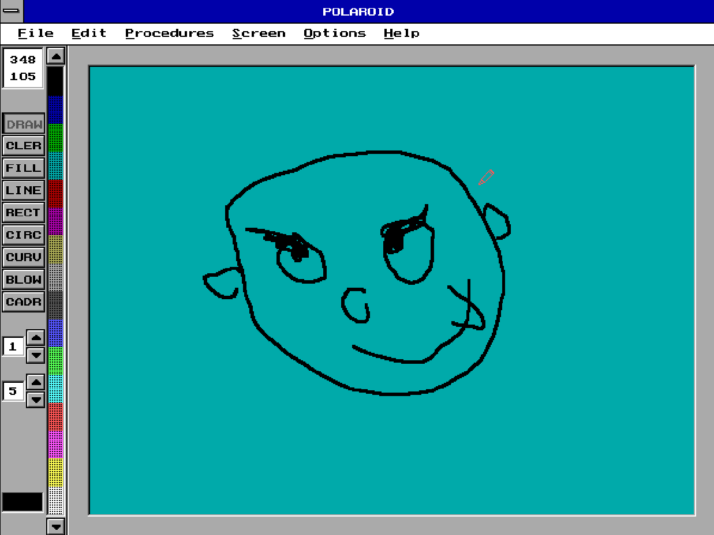

# polaroid

My drawing application written in Pascal during childhood.

The operating system is MS DOS, so this is running under emulation.

You can draw, erase, even save/load your drawings!

I put a lot of nights on this one, this software is almost complete!

[click here to play!](https://blaisetine.github.io/polaroid)
